# HPC Skilling Hands-On Exercises
Azure HPC OnDemand Platform or azhop, delivers an end-2-end deployment mechanism for a complete HPC cluster solution in Azure. Industry standard tools like Terraform, Ansible and Packer are used to provision and configure this environment containing :

* An OpenOn Demand Portal for a unified user access, remote shell access, remote visualization access, job submission, file access and more,
* An Active Directory for user authentication and domain control,
* An Open PBS or SLURM Job Scheduler,
* Azure Cycle Cloud to handle autoscaling of nodes thru job scheduler integration,
* A Jumpbox to provide admin access,
* Azure Netapp Files for home directory and data storage,
* A Lustre cluster for the scratch storage with HSM capbilities to Azure Blobs thru a RobinHood integration,
* Grafana dashboards to monitor your cluster

## <u>Objective</u>

-   Create a deployment VM

-   Prepare the Deployment VM

-   Preparing for Azure Deployment

-   Deploy the environment

# Create a deployment VM

## Create a deployer VM running Ubuntu 20.04. This will be used as the deployment VM. **Making sure to select West Europe as region.**

## Connect to the virtual machine using ssh. You can locate the public IP Address by navigating to the newly created VM and clicking copy.

# Prepare the deployment VM

In this section we will

-   Clone the Repo

-   Setup the Tool-Chain

-   Set the Azure Subscription (using CLI)

-   Accept Agreements

Clone the repo by running the following command. 
git clone <https://github.com/Azure/az-hop.git>  

Next Change directory 
cd az-hop/  

Setting up the Tool-Chain will download and install the necessary tools need for deployment . This can be done by running the following command.

sudo ./toolset/scripts/install.sh

Next, we need to login with the Azure CLI to set subscription context and accept some licensing agreements for netApp use. Log into Azure using CLI by running the following command.

az login

Open the link in the browser and enter the code.

Click the next button and select the required account to login.

After login, all available accounts will be listed. Match the "id" with the "Subscription ID" of your resource group where you created the Deployment VM.

Next, we need to set the subscription context by running the following command.

az account set -s \<SubscriptionID\>

make sure the context was set correctly by using the following command.

az account show

Next, The Azure HPC Lustre marketplace image terms need to be accepted by using the following command.

az vm image terms accept \--offer azurehpc-lustre \--publisher azhpc \--plan azurehpc-lustre-2_12

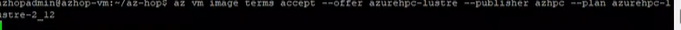

The AlmaLinux Marketplace image is used, the terms need to be accepted as well by using the following command.

az vm image terms accept \--offer almalinux-hpc \--publisher almalinux \--plan 8_5-hpc-gen2

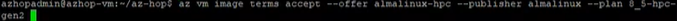

# Deployment

In this section you will need to

-   Define Environment variables

-   Create passwords

-   Get the ondemand_FQDN

-   Retrieve password

-   Deploy build

-   Verify access to portal

Please make sure to verify the quota.

When using the default configurations to build your environment, make sure you have enough quota for:

    1.  10 cores of Standard BS Family (5 x Standard_B2ms)

        i.  4 cores of Standard DSv5 Family (1 x Standard_D4s_v5)
        ii. 80 cores of Standard DDv4 Family (2 x Standard_D8d_v4, 2 x Standard_D32d_v4)

For the compute and visualization nodes, you can adjust the maximum quota in your configuration file.

    1.  Code Server (10 cores of Standard FSv2 Family) 
    2.  Compute Nodes depending on your configuration and needs :
        i.  220 cores Standard_HC44rs
        ii. and/or 600 cores of Standard HBrsv2 Family
        iii. and/or 600 cores of Standard HBv3 Family
    3)  Remote Visualization (18 cores of Standard NV Family)

Next, we need to change variables to match your Azure resources. An az-hop environment is defined in the config.yml configuration file. Before starting, use the config.tpl.yml template to build a configuration file for your deployment. This is done by opening the config.tpl.yml file in editor and updating variables. Below will show you the mandatory parameters that need to be updated

This is done by running this command:

Vi config.tpl.yml

**Changes to be made below**

    # azure location name as returned by the command : az account list-locations -o table
    location: Match location of deployed
    # Name of the resource group to create all resources
    resource_group: Name of Resource group
    # If using an existing resource group set to true. Default is false
    use_existing_rg: true (switched from false to true)
&nbsp;

    image: /subscriptions//resourceGroups//providers/Microsoft.Compute/galleries//images/azhop-centos79-v2-rdma-gpgpu/latest
        # Set to true if AccelNet need to be enabled. false is the default value
        EnableAcceleratedNetworking: false
        # spot instance support. Default is false
        spot: true (switched from false to true)

**Please note that this section only needs to be updated if your subscription cannot handle the quotas mentioned in beginning of this section.**

    # Image plan specification (when needed for the image). Terms must be accepted prior to deployment
    # plan: publisher:product:name
        - name: hc44rs
        vm_size: Standard_HC44rs
        max_core_count: 440
        image: 
        /subscriptions//resourceGroups//providers/Microsoft.Compute/galleries//images/azhop-centos79-v2-rdma-gpgpu/latest
        spot: true
        - name: hb120v2
        vm_size: Standard_HB120rs_v2
        max_core_count: 1200
        image:
        /subscriptions//resourceGroups//providers/Microsoft.Compute/galleries//images/azhop-centos79-v2-rdma-gpgpu/latest
        #spot: true
        #- name: hb120v3
        #vm_size: Standard_HB120rs_v3
        #max_core_count: 1200
        image:
        /subscriptions//resourceGroups//providers/Microsoft.Compute/galleries//images/azhop-centos79-v2-rdma-gpgpu/latest
        spot: true
        # Queue dedicated to GPU remote viz nodes. This name is fixed and can\'t be changed
        - name: viz3d
        vm_size: Standard_NV12s_v3
        max_core_count: 48
        image:
        /subscriptions//resourceGroups//providers/Microsoft.Compute/galleries//images/centos-7.8-desktop-3d/latest
        ColocateNodes: false
        spot: false
        # Queue dedicated to share GPU remote viz nodes. This name is fixed and can\'t be changed
        - name: largeviz3d
        vm_size: Standard_NV48s_v3
        max_core_count: 96
        image:
        /subscriptions//resourceGroups//providers/Microsoft.Compute/galleries//images/centos-7.8-desktop-3d/latest
        ColocateNodes: false
        spot: false
        # Queue dedicated to non GPU remote viz nodes. This name is fixed and can\'t be changed
        - name: viz
        vm_size: Standard_D8s_v3
        max_core_count: 200
        image: /subscriptions//resourceGroups//providers/Microsoft.Compute/galleries//images/centos-7.8-desktop-3d/latest
        ColocateNodes: false
        spot: false

Once you have updated and saved the file run the command to create your config.yml file for deployment.

cp config.tpl.yml config.yml

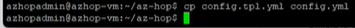

Now we can deploy the build infrastructure is done thru the build.sh utility script, calling terraform.

./build.sh -a apply

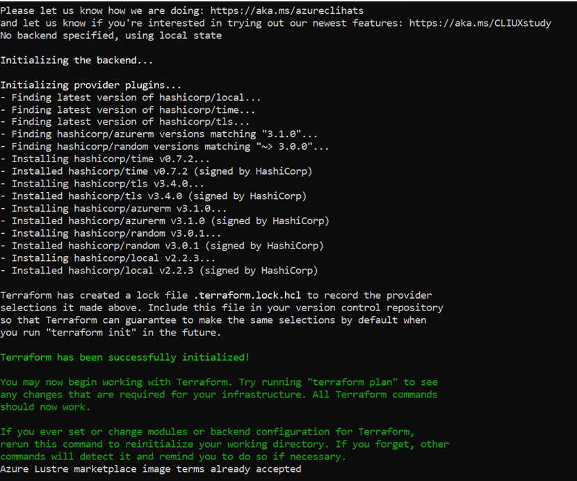

At the end of the build, there are several files created, which capture the state of a deployment. These are:

-   az-hop config file config.yml

-   Terraform state file tf/terraform.tfstate

-   Ansible parameter files playbooks/group_vars/all.yml, playbooks/inventory

-   Packer option file packer/options.json

-   Utility scripts bin/\*

Next run below command to configure ssh keys.

ssh Key Pair \${ADMIN_USER}\_id_rsa and \${ADMIN_USER}\_id_rsa.pub

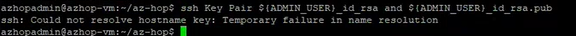

If you see the above error, simply run below command.

Ssh-keygen -t rsa

Press enter to save key

Press enter for no passphrase

Next, we need to retrieve The URL to access the azhop web portal. To do so we need to locate the ondemand_fqdn variable by running the below command. Copy url to notepad as we will need this later.

grep ondemand_fqdn playbooks/group_vars/all.yml

Now, we need to Create passwords via the create_password.sh utility script, which will use the config.yml file to retrieve the list of users to be created. For each, a password will be generated and stored as a secret in the keyvault built by the build command.

./create_passwords.sh

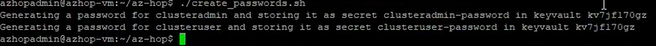

To retrieve a user's password from the key vault, use the command below. Copy this value to notepad as we will need it later.

./bin/get_secret clusteradmin

Building an image is done by the utility script packer/build_image.sh. to run this we must change directors to packer folder.

cd packer

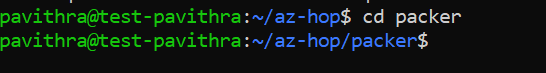

Now we need to Build the CentOS 7.9 HPC image. This is done by running the command below.

./build_image.sh -i azhop-centos79-v2-rdma-gpgpu.json

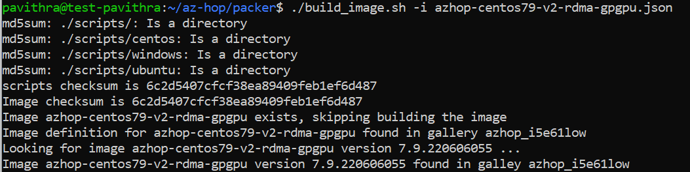

**#Please Note that due to lack of quota we do not Build the CentOS 7.8 HPC image, as we commented it out earlier in steps.**

#If you can meet quota and deploying all with defaults run the below command.

./build_image.sh -i azhop-centos-7.8.desktop-3d.json

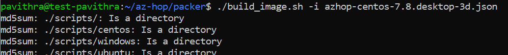

Once completed you will be asked to update the git submodule. This will clone the repo into "playbooks/roles/ood-ansible"

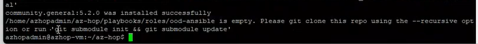

This is done by running this command.

Git submodule init && git submodule

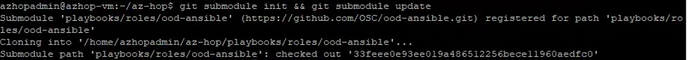

We can now finish the installation by installing the software, by entering the below command.

./install.sh

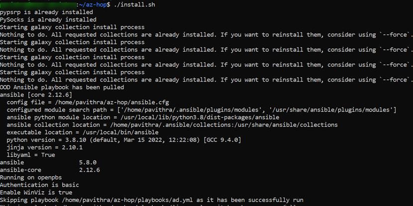

Finally, to verify access navigate to URL that we copied into notepad, and log in as "clusteradmin" and use the password we copied over to notepad.

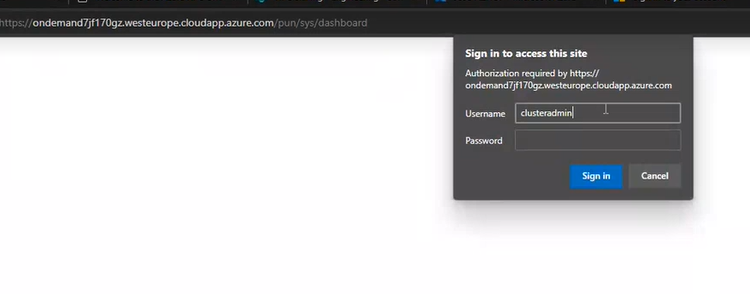

You should now be logged into the Dashboard.

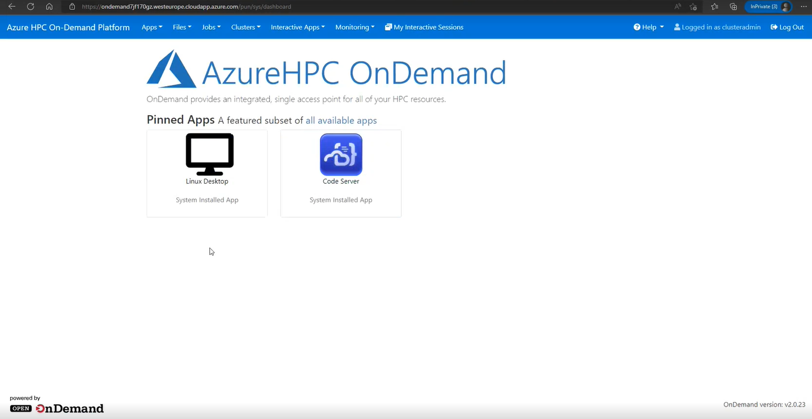

